**Introduction**

The purpose of this lab was for the group to gain knowledge in the area of automated testing, as well as test coverage. By enhancing our test suites from assignment two with a focus on adding more thorough branch and line coverage, we developed a comprehensive set of tests for the methods in the Range Class and Data Utilities Class. The use of automated testing in JUnit combined with the code coverage inspection element of EclEmma was a great way to gain experience. Each section of the lab allowed the team to refine their skills in the design, development, and execution of tests. Lastly, it helped us evaluate the quality of the tests written. 

**Manual data-flow coverage calculations for X and Y methods**

**Range**

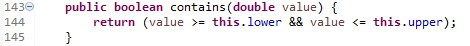

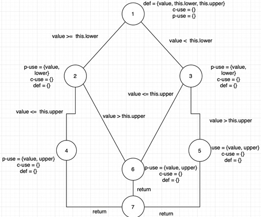

<table>
  <tr>
   <td>Line Number
   </td>
   <td>Node
   </td>
   <td>Def
   </td>
   <td>Use
   </td>
  </tr>
  <tr>
   <td>143
   </td>
   <td>1
   </td>
   <td>value, upper, lower
   </td>
   <td>
   </td>
  </tr>
  <tr>
   <td>144
   </td>
   <td>2
   </td>
   <td>
   </td>
   <td>value, lower
   </td>
  </tr>
  <tr>
   <td>144
   </td>
   <td>3
   </td>
   <td>
   </td>
   <td>value, lower
   </td>
  </tr>
  <tr>
   <td>144
   </td>
   <td>4
   </td>
   <td>
   </td>
   <td>value, upper
   </td>
  </tr>
  <tr>
   <td>144
   </td>
   <td>5
   </td>
   <td>
   </td>
   <td>value, upper
   </td>
  </tr>
  <tr>
   <td>144
   </td>
   <td>6
   </td>
   <td>
   </td>
   <td>value, upper
   </td>
  </tr>
  <tr>
   <td>144
   </td>
   <td>7
   </td>
   <td>
   </td>
   <td>value, upper, lower
   </td>
  </tr>
</table>

value: (143,144)

value (nodal): (1,2) , (1,3), (1,4), (1,5), (1,6)

upper: (143,144)

upper (nodal): (1, 4), (1, 5), (1, 6)

lower: (143,144)

lower (nodal): (1, 2), (1, 3)

**DU Path Sets**

du (1, value) = {[1,2,4,7], [1,2,6,7], [1,3,6,7], [1,3,5,7]}

du (1, upper) = {[1,2,4,7], [1,2,6,7], [1,3,6,7], [1,3,5,7]}

du (1, lower) = {[1,2,4,7], [1,2,6,7], [1,3,6,7], [1,3,5,7]}

**DU Pair Sets**

du (1, 2, value) = {[1,2]}

du (1, 3, value) = {[1,3]}

du (1, 4, value) = {[1,2,4]}

du (1, 5, value) = {[1,3,5]}

du (1, 6, value) = {[1,2,6], [1,3,6]}

du (1, 7, value) = {[1,2,4,7], [1,2,6,7], [1,3,6,7], [1,3,5,7]}

du (1, 2, lower) = {[1,2]}

du (1, 3, lower) = {[1,3]}

du (1, 7, lower) =  {[1,2,4,7], [1,2,6,7], [1,3,6,7], [1,3,5,7]}

du (1, 4, upper) = {[1,2,4]}

du (1, 5, upper) = {[1,3,5]}

du (1, 6, upper) = {[1,3,6], [1,2,6]}

du (1, 7, upper) = {[1,2,4,7], [1,2,6,7], [1,3,6,7], [1,3,5,7]}

**positiveIntegerContainsTest()**

DU pairs covered:

value:  (143, 144)

upper: (143, 144)

lower: (143, 144)

**negativeIntegerContainsTest() **

DU pairs covered:

value:  (143, 144)

upper: (143, 144)

lower: (143, 144)

**zeroRangeContainsTest() **

DU pairs covered:

value:  (143, 144)

upper: (143, 144)

lower: (143, 144)

**upperBoundContainsTest() **

DU pairs covered:

value:  (143, 144)

upper: (143, 144)

lower: (143, 144)

**lowerBoundContainsTest() **

DU pairs covered:

value:  (143, 144)

upper: (143, 144)

lower: (143, 144)

**outsideUpperBoundContainsTest()**

DU pairs covered:

value:  (143, 144)

upper: (143, 144)

lower: (143, 144)

**outsideLowerBoundContainsTest() **

DU pairs covered:

value:  (143, 144)

upper: (143, 144)

lower: (143, 144)

**doubleContainsTest() **

DU pairs covered:

value:  (143, 144)

upper: (143, 144)

lower: (143, 144)

**We have 100% coverage, as we missed no DU-pairs in the method ‘contains’.**

**DataUtilities**

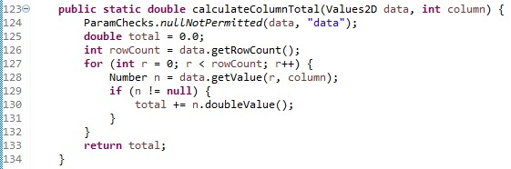

<table>
  <tr>
   <td>Line Number
   </td>
   <td>Node
   </td>
   <td>Def
   </td>
   <td>Use
   </td>
  </tr>
  <tr>
   <td>123
   </td>
   <td>1
   </td>
   <td>Data, column
   </td>
   <td>
   </td>
  </tr>
  <tr>
   <td>124
   </td>
   <td>1
   </td>
   <td>
   </td>
   <td>data
   </td>
  </tr>
  <tr>
   <td>125 
   </td>
   <td>1
   </td>
   <td>total
   </td>
   <td>
   </td>
  </tr>
  <tr>
   <td>126 
   </td>
   <td>1
   </td>
   <td>rowCount
   </td>
   <td>data
   </td>
  </tr>
  <tr>
   <td>127 
   </td>
   <td>1 & 2 & 6
   </td>
   <td>r
   </td>
   <td>R, rowcount
   </td>
  </tr>
  <tr>
   <td>128 
   </td>
   <td>3
   </td>
   <td>n
   </td>
   <td>R, data, column
   </td>
  </tr>
  <tr>
   <td>129 
   </td>
   <td>3
   </td>
   <td>
   </td>
   <td>n
   </td>
  </tr>
  <tr>
   <td>130 
   </td>
   <td>4
   </td>
   <td>total
   </td>
   <td>Total, n
   </td>
  </tr>
  <tr>
   <td>131 
   </td>
   <td>4
   </td>
   <td>
   </td>
   <td>
   </td>
  </tr>
  <tr>
   <td>132
   </td>
   <td>7
   </td>
   <td>
   </td>
   <td>
   </td>
  </tr>
  <tr>
   <td>133
   </td>
   <td>7
   </td>
   <td>
   </td>
   <td>total
   </td>
  </tr>
  <tr>
   <td>134
   </td>
   <td>7
   </td>
   <td>
   </td>
   <td>
   </td>
  </tr>
</table>

Note:

127.1 is the portion of line 127 that reads ‘int r = 0;’

127.2 is the portion of line 127 that reads ‘r &lt; rowCount;’

127.3 is the portion of line 127 that reads ‘r++’

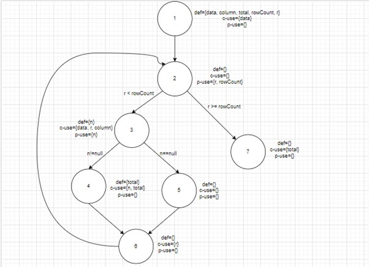

Data: (123,124), (123,126), (123,128)

Data (nodal): (1,1) , (1,1), (1,3)

Column: (123,128)

Column (nodal): (1, 3)

Total: (125,130), (125,133), (130,133)

Total (nodal): (1, 4), (1, 7), (4, 7)

rowCount: (126,127.2) 

rowCount (nodal): (1,2)

R: (127.1, 128), (127.1, 127.2), (127.1, 127.3)

R (nodal): (1, 3), (1,2), (1,6)

N: (128,129), (128,130) 

N (nodal): (3,3), (3,4)

DU Path Sets

du (1, data) = {[1,2,3]}

du (1, rowCount) = {[1,2]}

du (1,column) = {[1,2,3]}

du (1, total) = {[1,2,3,4], [1,2,3,4,6,2,7], [1,2,3,5,6,2,7], [1,2,7]}

du (4,total) = {[4,6,2,7]}

du (1, r) = {[1,2,3], [1,2], [1,2,3,4,6], [1,2,3,5,6]}

du (3, n) = {[3,4]}

DU Pair Sets

du (1, 3, data) = {[1,2,3]}

du (1, 2, rowCount) = {[1,2]}

du (1, 3, column) = {[1,2,3]}

du (1,4,total) = {[1,2,3,4]}

du (1,7, total) = {[1,2,3,4,6,2,7], [1,2,3,5,6,2,7], [1,2,7]}

du (4, 7, total) = {[4,6,2,7]}

du (1, 3, r) = {[1,2,3]}

du (1, 2, r) = {[1,2]}

du (1, 6, r) = {[1,2,3,4,6], [1,2,3,5,6]}

du (3, 4, n) = {[3,4]}

Data:  (123,124),(123,126), (123,128)

Column: (123,128)

Total: (125,130), (125,133), (130,133)

rowCount: (126,127.2) 

R: (127.1, 128), (127.1, 127.2), (127.1, 127.3)

N: (128,129), (128,130) 

**minBoundaryCalculateColumnTotalTest**

DU pairs covered:

Data:  (123,124),(123,126), (123,128)

Column: (123,128)

Total: (125,130), (130,133)

rowCount: (126,127.2) 

r: (127.1, 128), (127.1, 127.2), (127.1, 127.3)

n: (128,129), (128,130) 

**maxBoundaryCalculateColumnTotalTest**

DU pairs covered:

Data:  (123,124),(123,126), (123,128)

Column: (123,128)

Total: (125,130), (130,133)

rowCount: (126,127.2) 

r: (127.1, 128), (127.1, 127.2), (127.1, 127.3)

n: (128,129), (128,130) 

**belowMaxBoundaryCalculateColumnTotalTest**

DU pairs covered:

Data:  (123,124),(123,126), (123,128)

Column: (123,128)

Total: (125,130), (130,133)

rowCount: (126,127.2) 

r: (127.1, 128), (127.1, 127.2), (127.1, 127.3)

n: (128,129), (128,130) 

**aboveMinBoundaryCalculateColumnTotalTest**

DU pairs covered:

Data:  (123,124),(123,126), (123,128)

Column: (123,128)

Total: (125,130), (130,133)

rowCount: (126,127.2) 

r: (127.1, 128), (127.1, 127.2), (127.1, 127.3)

n: (128,129), (128,130) 

**aboveMaxBoundsCalculateColumnTotalTest**

DU pairs covered:

Data: (123,124), (123,126), (123,128)

Column: (123,128)

rowCount: (126,127.2) 

R: (127.1, 128), (127.1, 127.2)

**belowMinBoundsCalculateColumnTotalTest**

DU pairs covered:

Data: (123,124), (123,126), (123,128)

Column: (123,128)

rowCount: (126,127.2) 

R: (127.1, 128), (127.1, 127.2)

**nullIntInputCalculateColumnTotalTest**

DU pairs covered

Data: (123,124), (123,126), (123,128)

Column: (123,128)

rowCount: (126,127.2) 

R: (127.1, 128), (127.1, 127.2)

**nullValues2DInputCalculateColumnTotalTest**

DU pairs covered

Data:  (123,124)

**middleOfBoundariesCalculateColumnTotalTest**

DU pairs covered:

Data:  (123,124),(123,126), (123,128)

Column: (123,128)

Total: (125,130), (130,133)

rowCount: (126,127.2) 

r: (127.1, 128), (127.1, 127.2), (127.1, 127.3)

n: (128,129), (128,130) 

**lotsOfRowsCalculateColumnTotalTest**

DU pairs covered:

Data:  (123,124),(123,126), (123,128)

Column: (123,128)

Total: (125,130), (130,133)

rowCount: (126,127.2) 

r: (127.1, 128), (127.1, 127.2), (127.1, 127.3)

n: (128,129), (128,130) 

**negativeValuesCalculateColumnTotalTest**

DU pairs covered:

Data:  (123,124),(123,126), (123,128)

Column: (123,128)

Total: (125,130), (130,133)

rowCount: (126,127.2) 

r: (127.1, 128), (127.1, 127.2), (127.1, 127.3)

n: (128,129), (128,130) 

The only DU Pair that was missed in all of our test cases is:

Total: (125,133)

**Therefore, because we have 13 total DU pairs, and only missed one, the DU-pair coverage we achieved is 12/13 * 100 = 92.3%.**

**A detailed description of the testing strategy for the new unit test**

To improve our test suite from Assignment 2 to have acceptable coverage, we started with the manual calculation of DU pairs and coverage for all the methods under test in Assignment 2. We noted all of the branches that had been missed in our original suite. For example, in the method getCumulativePercentages(), we had missed an important branch that dealt with null values. Next, we looked at the methods that had 0% coverage, since Assignment 2 had only asked for the testing of 5 methods in Range and 5 methods in DataUtilities. Then, we designed test cases for the previously untested methods (for example, intersects() in Range).

Next, we ran ECLEMMA on our Assignment 2 test suite, and noted the branches we missed in the source code, as well as the methods we missed. We then looked up the requirements for those methods and designed test cases the same we did in Assignment 2, using Equivalence Classes and Boundary Testing. 

Finally, we ensured that all the branches had been covered, by writing a couple more tests per method. In total, we added 14 tests for DataUtilities and 42 tests for Range. All in all, using this strategy, we were able to achieve a higher amount of coverage than what was required.

Range Line Coverage in Assignment 2 

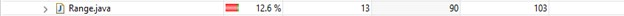

Range Line Coverage in Assignment 3

DataUtilities Line Coverage in Assignment 2

DataUtilities Line Coverage in Assignment 3

**A high level description of five selected test cases you have designed using coverage information, and how they have increased code coverage**

**equalsTest()**

This test case was designed to test the ‘.equals’ function of the java library Range. In our previous version of tests, the function ‘.equals’ wasn’t considered, as we only had to test a portion of the Range functions. For obvious reasons, this led to lower overall coverage, as we were testing 0 branches and 0 lines in the ‘.equals’ function. This simple ‘equalsTest()’ constructs two example ranges that are equal to each other, and expects the ‘.equals’ function to return the value ‘true’.

**isNaNRangeTestTrue()**

This test case was designed to test the ‘.isNaNRange()’ function of the java library Range. In our previous version of tests, the function ‘.isNaNRange()’ wasn’t considered, as we only had to test a portion of the Range functions. This led to lower overall coverage, as we were testing 0 branches and 0 lines/methods in the ‘.isNaNRange()’ function. This test (‘isNaNRangeTestTrue()’) constructs a valid range, from values 1.0 to 3.0. Because the range is NOT NaN, we expect a value of ‘false’ to be returned. 

**shiftTest()**

This test case was designed to test the ‘.shift’ function of the java library Range. In our previous version of tests from assignment 2, the function ‘.shift’ wasn’t considered, as we only had to test a portion of the Range functions. This led to lower overall coverage, as we were testing 0 branches and 0 lines/methods in the ‘.shift’ function. This test constructs two ranges, one from -1 to 1, and one from 0 to 2. We then perform the ‘.shift’ function on the range from -1 to 1, with a value of 1. We expect it to become equal to the range from 0 to 2. This test (‘shiftTest()’) should return true, and increase coverage by entering a previously untested method.

**smallCloneTest()**

This test case was designed to test the ‘.clone’ function of the java library DataUtilities. In our previous version of tests from assignment 2, the function ‘.clone’ wasn’t considered, as we only had to test 5 of the DataUtilities functions. This led to lower overall coverage, as we were testing 0 branches and 0 lines/methods in the ‘.clone’ function. The test ‘smallCloneTest()’ constructs a 2D array of doubles named data, with many random values in it. We then use the ‘.clone’ method of DataUtilities to clone the 2D double array into a new 2D double array: result. Lastly, we assert that the new 2D double array ‘result’ is equal to the original, ‘data’. This test should return the value ‘true’.

**moreCoverageRowTotalTest()**

In this test, we are testing a function that was already tested in Assignment 2. Due to lack of foresight, we had a lower branch coverage than anticipated in the function tested: ‘.calculateRowTotal’. This function contains a for loop that holds an if statement that states the following: ‘if (n!=null)‘. In every single test case for the function ‘.calculateRowTotal’ in Assignment 2, the number n was not equal to null. Because of this, we were only achieving half branch coverage in this specific test. In the new test case, some of the numbers ‘n’ are set to ‘null’, so that the other half of the branch is explored. As a result of this new test case, the branch coverage for this function was raised to 100%. 

**A detailed report of the coverage achieved of each class and method (a screen shot from the code cover results in green and red color would suffice)**

**Range:**

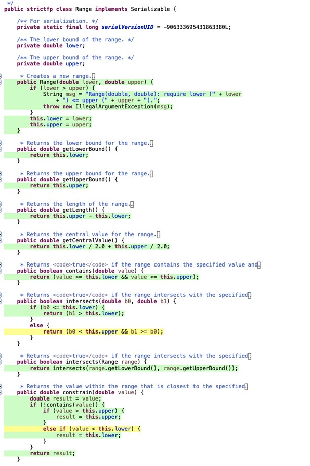

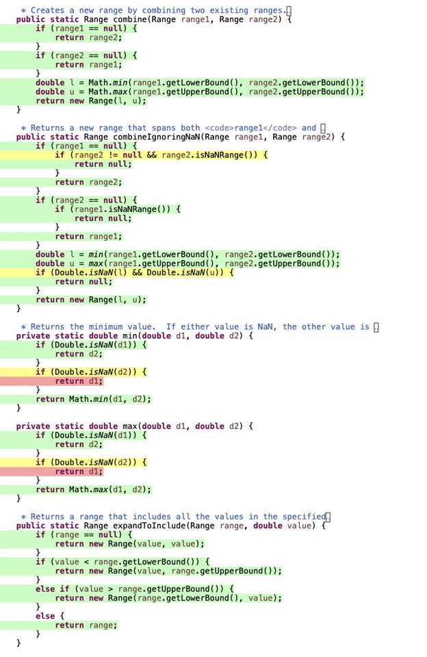

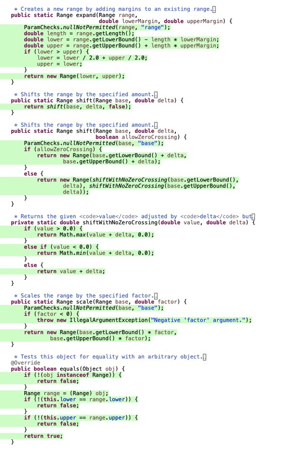

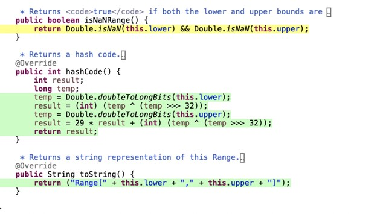

**DataUtilities:**

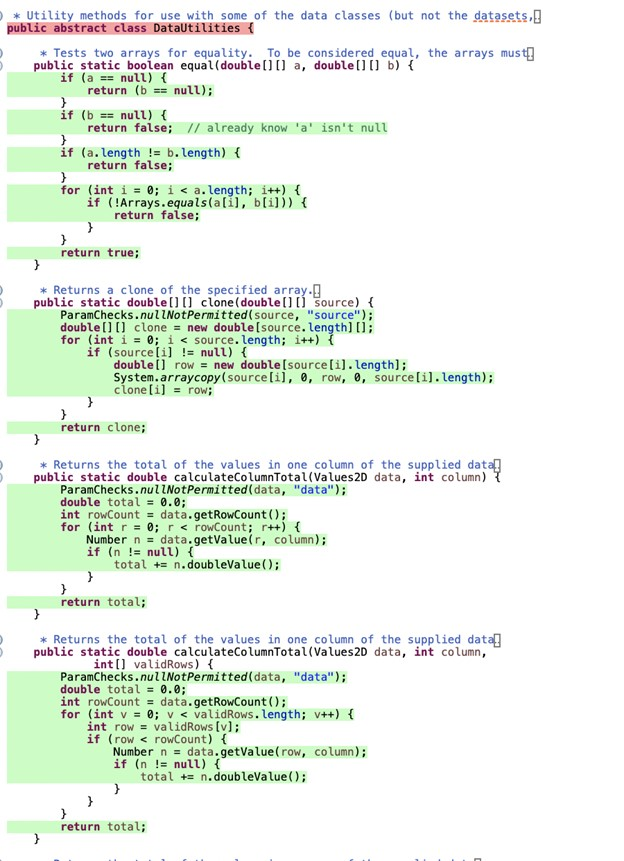

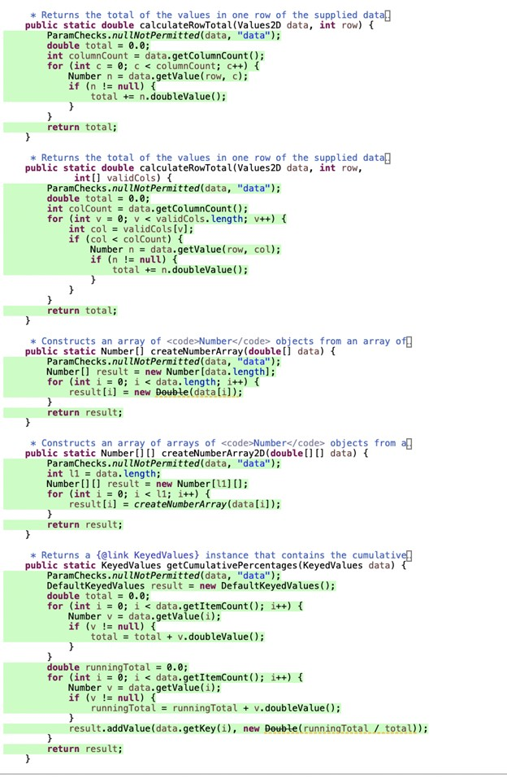

**Pros and Cons of coverage tools used and Metrics you report**

Initially, we tried CodeCover and Clover as our coverage tools. While they provided more in-depth metrics than Eclemma, they were unwieldy and large to use. Additionally, they were incompatible with our JMock based test cases and we did not see the merit in rewriting 36 test cases from Assignment 2. Therefore, we used Eclemma, since it is lightweight and comes packaged with Eclipse, and works well with JMock test cases.

Pros:

* Written statements of expected behavior.
* Cost effective technique to deliver high quality of product.
* A risk mitigation strategy.
* Gives good insight of what segments of code have been tested

Cons:

* Testing coverage limitation.
* Requires more effort and expense during the preparations of test executions.

Metrics:

We learned that branch coverage is much stronger than line coverage because line coverage does not always show that every condition in an if statement is being hit, making it less precise. Additionally, method coverage is more imprecise than line coverage, since the tests tend to miss out on variables being declared outside methods.

**A comparison on the advantages and disadvantages of requirements-based test generation and coverage-based test generation.**

One of the advantages of coverage-based testing is that the test suite is more thorough with the range of inputs accepted by the program. It gives the programmer a good idea of how well they are testing their programs to ensure robustness. This, in turn, ensures that the characteristics of each method are examined under a variety of conditions. The real disadvantage of this method is the intensive time it takes to develop a suite, and the extensive amount of memory that is required to create more tests. In contrast, requirements testing is effective when programmers can use their knowledge of the number of requirements that define a test suite to test the most appropriate aspects of a program. It is less intensive than coverage-based testing, as the programmer is not focused on testing every single aspect of a program. However, this leads to a less complete test suite. While requirements-based testing is a more targeted method than coverage-based testing, a programmer may be leaving untested features of a program behind in this method.

**A discussion on how the team work/effort was divided and managed.**

The group was split into two parts, one part covered the tests for the DataUtilities class and the other covered the Range class. One member in each group wrote new coverage tests for half the methods. All members came together to review the tests that were made and what new method they covered.

** Any difficulties encountered, challenges overcome, and lessons learned from performing the lab.**

<table>
  <tr>
   <td><strong>Difficulty encountered</strong>
   </td>
   <td><strong>How we overcame this difficulty</strong>
   </td>
  </tr>
  <tr>
   <td>The Range class had 2 methods that were private, so they could not be tested independently.
   </td>
   <td>We realized that those two methods were called many times in other methods, so we were still able to reach optimal coverage
   </td>
  </tr>
  <tr>
   <td>Some branches were impossible to hit because they require invalid input
   </td>
   <td>Cannot overcome this, however coverage is not always perfect
   </td>
  </tr>
  <tr>
   <td>Some of the methods were boolean, that only had one line, so they were very hard to DU test.
   </td>
   <td>We split up the boolean statement into separate sub sections.
   </td>
  </tr>
</table>

Lessons learned:

We learned how to leverage coverage-based testing as a way to develop a more robust test suite, and to ensure further software quality within our program.

**Comments/feedback on the lab itself.**

This lab was an interesting introduction to developing the skills needed to assess the strength of our unit test suite. We were able to significantly strengthen coverage across both the DataUtilities and Range classes, to ensure the classes and associated methods were adequately tested. Getting familiar with new coverage tools, as well as the manual calculations were important for us in our careers to develop better software. We found this lab to be more structured than others, which led to clarity among the group members and equal division of workload. 
